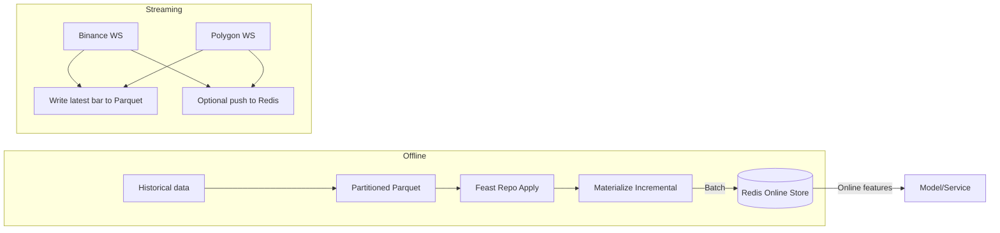

# 📈 Feast for Finance
> Offline-first features with low-latency online serving, built on Feast for crypto/FX workflows.

[](https://github.com/your-org/fin-feast-poc/actions/workflows/ci.yml) [](LICENSE)  [](docs/README.md) [](https://github.com/astral-sh/ruff) [](https://feast.dev) [](https://redis.io)


## Why Feast for Finance
This project is a practical, batteries-included template for applying Feast to financial data (crypto/FX). It emphasizes an offline-first workflow for correctness and reproducibility, complemented by an online store for low-latency inference.

---

## 💡 Use Cases
| Scenario | Description |
|-----------|--------------|
| Experiment build | Precompute rolling indicators (returns, MAs, RSI, ATR) for consistent training data. |
| Offline–online parity | Materialize precomputed features so the same values appear in the online store. |
| Low-latency serving | Serve fresh feature vectors from Redis between materialization cycles. |
| Streaming bootstrap | Stream minute bars (Binance/Polygon) to Parquet; optionally push the latest bar online. |

> Parquet is the source of truth; Redis is the fast cache for serving.

---

## 🧭 Data & Feature Flow


---

## ⚡ Quickstart
```bash
# 1) Copy env and start Redis
cp .env.example .env
make up

# 2) Install (dev)
make setup

# 3) Generate synthetic data (daily + minute)
finfeast-generate --zone current --start 2025-09-01 --end 2025-10-12 --freq daily --symbols X:BTCUSD C:GBPUSD
finfeast-generate --zone current --start 2025-10-01 --end 2025-10-12 --freq minute --symbols X:BTCUSD C:GBPUSD

# 4) Apply repo + materialize offline->online
make apply
finfeast-materialize --zone current

# 5) Query online features (demo)
python scripts/online_query_demo.py --symbols X:BTCUSD C:GBPUSD
# Example output snippet
# Symbol=X:BTCUSD | minute_ohlcv_fv:open=... close=... rsi_14=... ma_20=...
```

---

## 🎁 What you get
- Offline store (Parquet) for reliable feature engineering
  - Partitioned, append-only data with precomputed rolling indicators (e.g., returns, moving averages, RSI, ATR)
  - Immutable experiment snapshots for repeatable training
  - Atomic writes and consistent partition schemas out of the box
- Online store (Redis) for fast inference
  - Materialize incremental features to Redis on a schedule
  - Streaming ingestors optionally push the latest bar to the online store in near real time
- Consistent features across training and serving
  - Stateful transforms are computed offline and materialized to ensure offline–online parity
  - On-demand features are kept stateless and lightweight by design
- Developer-friendly workflow
  - Console scripts for common tasks (generate, materialize, validate)
  - Makefile targets for setup, data generation, materialization, and E2E shortcuts
  - Tests for I/O, feature pipelines, and streaming helpers; CI for unit (default), optional integration and E2E
  - Clear docs for architecture, operations, testing, and troubleshooting

---

## 📶 Streaming minute bars
Preferred (no API key): Binance streaming ingestor writes Parquet and can push online:
```bash
python service/binance_stream_ingestor.py --symbols X:BTCUSD C:ETHUSD --push-online
```
Notes:
- Maps Feast symbols to Binance pairs: X:BTCUSD -> btcusdt, C:ETHUSD -> ethusdt
- Writes partitioned Parquet and optionally pushes to Redis via Feast
- Resilience: automatic reconnect with exponential backoff and jitter; online push errors are logged and do not stop ingestion

Optional: Polygon streaming (requires POLYGON_API_KEY):
```bash
python service/polygon_stream_ingestor.py --symbols X:BTCUSD C:GBPUSD --push-online
```
- Resilience: online push errors are caught and logged; streaming continues

---

## 🔁 Typical flow
1) Generate or ingest historical data into the offline store
2) Apply the Feast repo and materialize features
3) Train and evaluate models on consistent, precomputed features
4) Serve low-latency predictions with an online store that mirrors the offline feature definitions
5) Optionally run the streaming ingestor to push the latest minute bars and keep the online store fresh

## 🎯 Who is this for?
- Quant researchers and data scientists working with minute/daily bars (crypto or FX) who want reproducible feature pipelines
- Data/ML engineers who need a clean path from offline feature engineering to online, low-latency inference using the same definitions
- Teams building trading, risk, or alerting systems that require fresh features served from an online store between materialization cycles
- Platform/infra engineers looking for a tested reference implementation of Feast in a finance context
- Educators and students seeking a practical, local-first stack to learn offline/online workflows

---

## 🗂️ Repository layout
| Folder | Purpose |
|--------|---------|
| `fin_feast/` | Core package: utils (env, io, symbols), features (rolling), online (push), logging |
| `feature_repo/` | Feast repo: entities, sources, feature views, registry (local) |
| `service/` | Streaming ingestors: Binance and Polygon |
| `scripts/` | Utilities: data generation, materialize, demos, retention |
| `tests/` | Unit (default), integration (markers), e2e |
| `docs/` | Architecture, usage, features, operations, testing, troubleshooting, decisions |

---

## 📚 Documentation
- [Docs index](docs/README.md)
- [Architecture](docs/ARCHITECTURE.md) • [Usage](docs/USAGE.md) • [Features](docs/FEATURES.md)
- [Testing](docs/TESTING.md) • [Operations](docs/OPERATIONS.md) • [Troubleshooting](docs/TROUBLESHOOTING.md)
- [Design decisions](docs/DESIGN_DECISIONS.md) • [E2E scenarios](docs/E2E_SCENARIOS.md) • [Security](docs/SECURITY.md)

---

## 🤝 Contributing
See [CONTRIBUTING.md](CONTRIBUTING.md) and [CODE_OF_CONDUCT.md](CODE_OF_CONDUCT.md).

## 🧭 License
Apache-2.0. See [LICENSE](LICENSE).

## 🔒 Security & privacy
- Please report security issues privately: SECURITY.md (contact listed)
- Do not commit secrets. Use `.env.example` as a template; `.env` is gitignored

## ⚠️ Disclaimer
This repository is for educational purposes and should not be considered financial advice.

---

Note: Update the CI badge URL to your actual org/repo after publishing.
