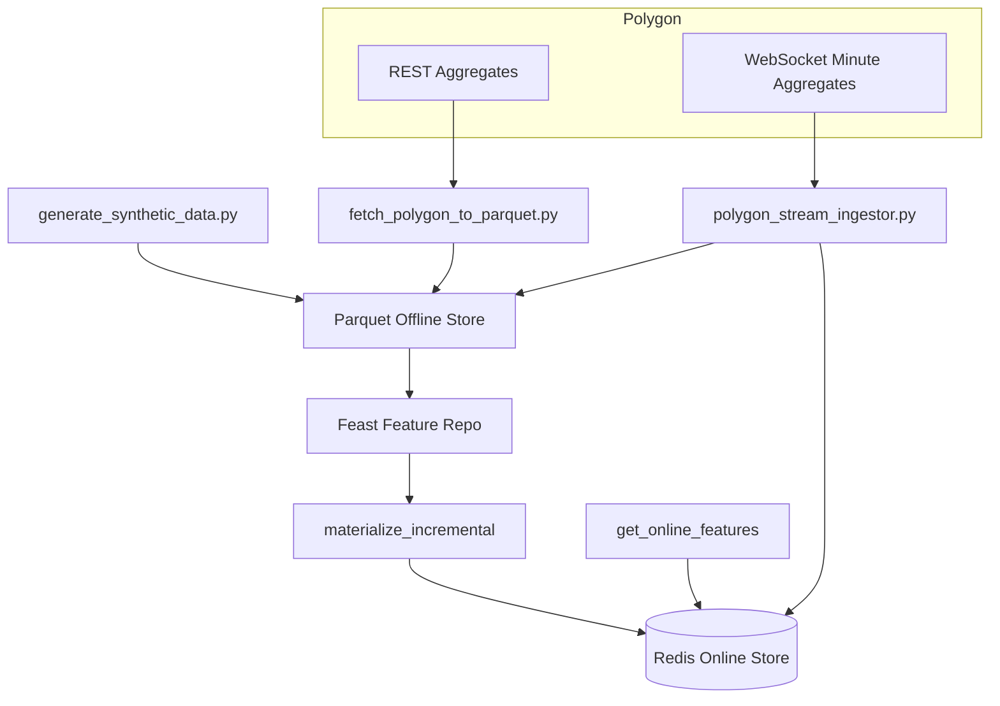
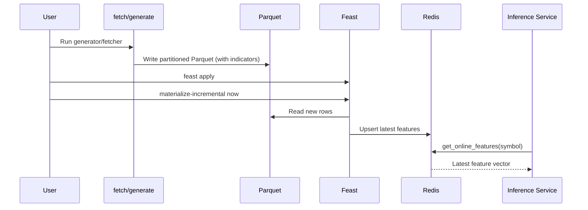
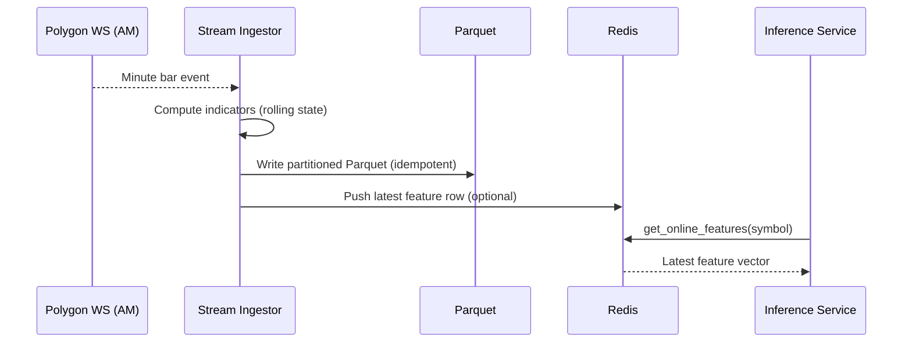

# Architecture

This document describes the system architecture for the Fin Feast POC, including batch (offline-first) and streaming minute-bar ingestion paths, data zones, and how features flow to the online store for inference.

## Overview
- Offline store: Parquet files partitioned by symbol and date
- Online store: Redis, populated via Feast materialize-incremental (batch) and optionally via push on each streaming event
- Data zones: `current` (rolling) and `experiments/<exp_id>` (immutable snapshots)
- Feature computation:
  - Precomputed offline: return_1, ma_5, ma_20, vol_20, rsi_14, atr_14
  - On-demand (stateless, ODFV): hlc3, ohlc4, vol_log, spread, body, vwap_premium

## Components (Mermaid)


## Batch path (sequence)


## Streaming path (sequence)


## Data zones and paths
- Base path resolved by env:
  - `FEAST_DATA_ZONE=current|experiment`
  - `FEAST_EXPERIMENT_ID=<id>` required for experiment zone
- Layout:
```
data/offline/
  current/
    daily/
    minute/
  experiments/<exp_id>/
    daily/
    minute/
```

## Parquet partitioning and schema
- Partition columns: `symbol` (directory segment) and `date=YYYY-MM-DD`
- File columns (per row):
  - Base: event_timestamp, open, high, low, close, vwap, volume
  - Indicators (precomputed): return_1, ma_5, ma_20, vol_20, rsi_14, atr_14
- Important: To avoid Arrow merge conflicts, the `symbol` column is NOT written inside Parquet files; it is provided by the partition directory (Solution A). When reading for warm-starts, code injects `symbol` from the path.

## Feast configuration
- Entity: `symbol` (string)
- FileSources: daily_ohlcv_source, minute_ohlcv_source
- FeatureViews: daily_ohlcv_fv (TTL ~400d), minute_ohlcv_fv (TTL ~14d)
- OnDemandFeatureView: derived_stateless_fv computed from minute_ohlcv_fv only
- Registry: `feature_repo/registry.db` (local)
- Online store: Redis at localhost:6379

## Freshness model
- Batch: materialize-incremental schedule (e.g., every 60s) brings new Parquet rows to Redis
- Streaming: push to online on each completed bar after computing indicators and writing Parquet; batch materialization still useful for healing/rebuilding

