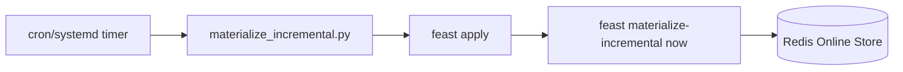
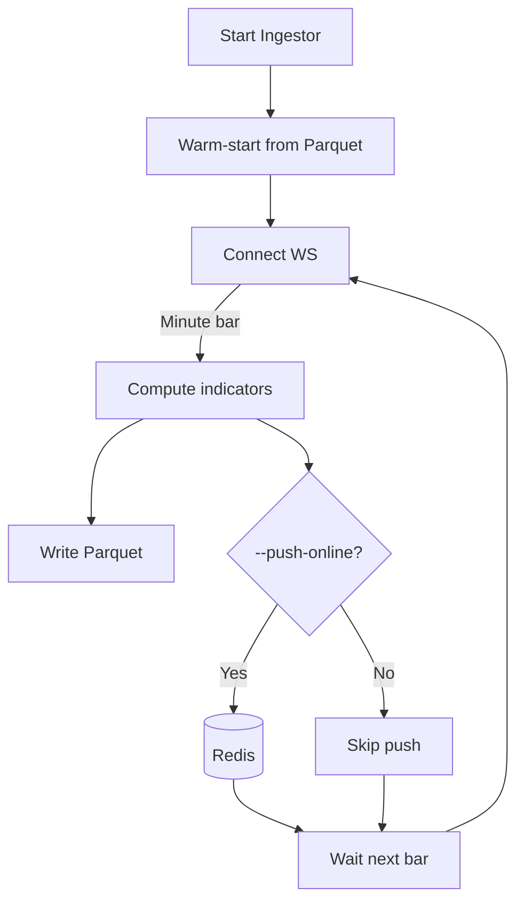

# Operations Guide

This document describes how to operate the batch and streaming pipelines, schedule materialization, and recover from failures.

## Operating modes
- Batch (offline-first): write Parquet via generator or REST fetcher; materialize to Redis on a schedule
- Streaming (low-latency): ingest minute bars from Polygon WS; compute indicators; write Parquet and optionally push latest online immediately

## Scheduling materialization
- Goal: keep online store fresh with new Parquet rows
- Example (cron, every minute):
```
* * * * * cd /path/to/fin-feast && . .venv/bin/activate && python scripts/materialize_incremental.py >> logs/materialize.log 2>&1
```
- Alternatively, a systemd timer or a simple loop can be used.

Materialization loop (Mermaid):


## Streaming ingestor
- Command:
```bash
python service/polygon_stream_ingestor.py --symbols X:BTCUSD C:GBPUSD --push-online
```
- Behavior:
  - Connects to Polygon WS AM (minute aggregates)
  - Warm-starts rolling state from recent Parquet
  - For each completed minute bar: compute indicators, write partitioned Parquet, and (if --push-online) write latest to Redis immediately

Streaming lifecycle (Mermaid):


## Recovery
- Redis lost data:
  - Run `python scripts/materialize_incremental.py` to repopulate
- Ingestor crashed/restarted:
  - It warm-starts rolling windows from last partitions; no special action required
- Feast registry drift:
  - Remove `feature_repo/registry.db` and run `make apply`
- Arrow merge error (schema):
  - Remove `data/offline` and regenerate; ensure writer retains both partition columns (`symbol`, `date`) inside files to keep schemas consistent across partitions.

## Backfill and experiments
- Backfill a large window via REST fetcher:
```bash
python scripts/fetch_polygon_to_parquet.py --zone current --start YYYY-MM-DD --end YYYY-MM-DD --freq daily --symbols X:BTCUSD C:GBPUSD
```
- Create experiment snapshot:
  - Write data into `data/offline/experiments/<exp_id>/{daily,minute}`
  - Set env `FEAST_DATA_ZONE=experiment` and `FEAST_EXPERIMENT_ID=<exp_id>`
  - Use `build_training_dataset.py` to materialize historical features

## Observability
- Logs: INFO by default (fin_feast/logging.py)
- Consider redirecting materialize and streaming logs to files (see cron example), and rotating logs in production

## Resilience and reliability (streaming)
- Reconnects: streamers automatically reconnect with exponential backoff and jitter (Binance). Backoff resets on successful connect.
- Online push isolation: failures to write to the online store are caught and logged; ingestion continues and Parquet remains the source of truth.
- Warm start: both streamers warm start from recent Parquet data to compute indicators (bounded window).

## HA considerations (production considerations)
- Redis persistence (AOF) enabled; for higher durability, consider managed Redis or Redis Cluster
- Multiple ingestor instances: ensure exactly-once semantics via idempotent partition writes keyed by (symbol, event_timestamp)
- Monitoring and alerting for WS connectivity and lag
