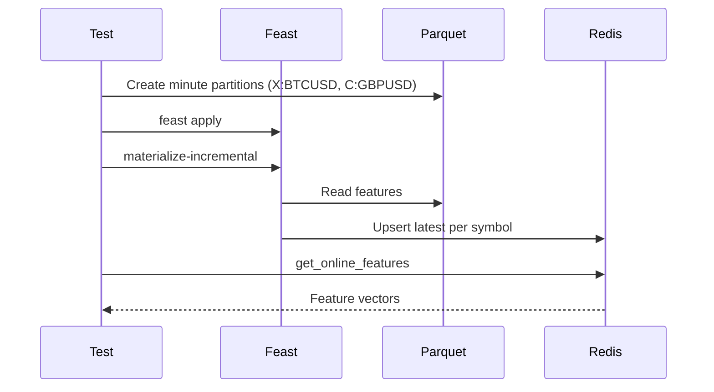

# Testing Guide

This guide explains what is covered by the test suite, how to run tests locally, and common pitfalls.

## How to run tests
```bash
# Ensure Python 3.11 venv is active and dependencies installed
pytest -q
```

- Redis is started/stopped by tests via docker-compose (see tests/conftest.py)
- Tests write data to the project-local data/ folder and isolate via per-test setup

## What the tests cover

### 1) tests/test_synthetic_ingestion.py
- Validates Parquet schema and timestamp types are UTC
- Ensures partitions are written under symbol=<sym>/date=YYYY-MM-DD
- Confirms indicators are present: return_1, ma_5, ma_20, vol_20, rsi_14, atr_14
- The file writer drops `symbol` from files to avoid Arrow merge conflicts and relies on the partition key

### 2) tests/test_feast_apply_and_materialize.py
- Spins up Redis using docker-compose
- Creates a minimal set of Parquet files for minute data
- Runs `feast apply` and `materialize-incremental`
- Queries `get_online_features` for two symbols and basic fields (including an ODFV stateless feature)

Sequence (Mermaid):


### 3) tests/test_historical_features.py
- Creates a small experiment snapshot (daily data)
- Sets FEAST_DATA_ZONE=experiment and FEAST_EXPERIMENT_ID for access
- Verifies get_historical_features joins the right rows/columns for a window

### 4) tests/test_stream_ingestor_simulated.py
- Simulates a short stream by writing just the latest row into a minute partition
- Asserts the partition file is present

## Common pitfalls
- Docker not running or missing docker-compose: tests will fail to create Redis
- Python version not 3.11: installation or runtime errors
- Feature registry drift: remove feature_repo/registry.db and re-apply
- Arrow merge errors: ensure partition columns are consistent (retain both `symbol` and `date` inside Parquet files)
- Timestamps not UTC: always ensure `event_timestamp` is tz-aware and in UTC

## CI tips (if adding CI later)
- Pre-pull Redis image to speed up
- Cache Python packages
- Ensure pyarrow is installed (already in project deps)
- Run lint and tests in separate jobs for clarity
